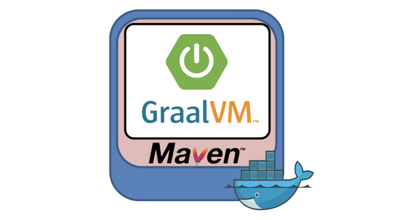

### Spring Boot 3 - GraalVM 


### 🔨 Run the App

#### Maven

<b>1 )</b> Download your project from this link shown below
```
    git clone https://github.com/Eukolos/spring-boot-3-example.git
```

<b>2 )</b> Go to the project's home directory shown below
```
    cd spring-boot-3-example
```

<b>3 )</b> Create native image though this command shown below
```
    mvn -Pnative spring-boot:build-image
```

<b>4 )</b> Run the project though this command shown below
```
    docker-compose up
```

### Used Dependencies
* Core
    * Spring
        * Spring Boot 3
        * Spring Web
        * H2 Database
* Docker
* GraalVM CE Java 17-22.3.0

### Create a Post

```
POST /v1/post
Accept: application/json
Content-Type: application/json
{
"title" : "GraalVM",
"body" : "uber fasttt",
}
RESPONSE: HTTP 200 (OK)
Location header: http://localhost:9090/v1/post
```

### Get Post List

```
GET /v1/post
Accept: application/json
Content-Type: application/json
{

}
RESPONSE: HTTP 200 (OK)
Content: paginated list 
Location header: http://localhost:9090/v1/post
```

### Get Post

```
GET /v1/post/{id}
Accept: application/json
Content-Type: application/json
{

}
RESPONSE: HTTP 200 (OK)
Content: paginated list 
Location header: http://localhost:9090/v1/post/{id}
```
